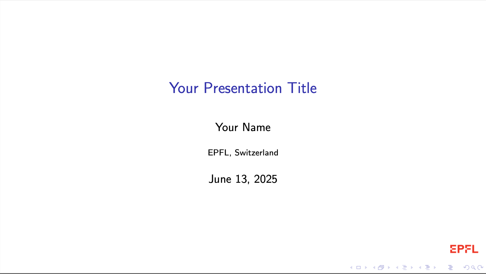
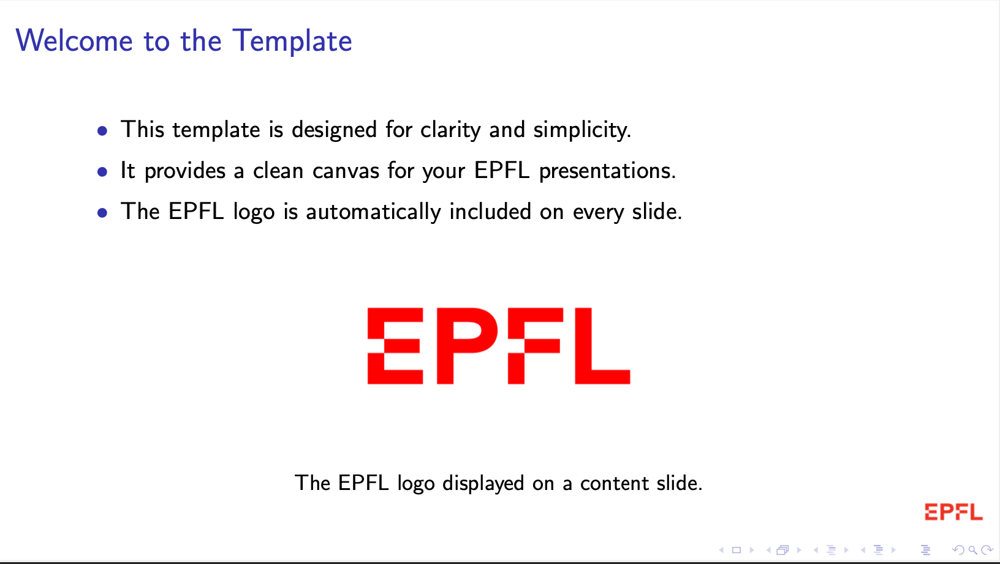
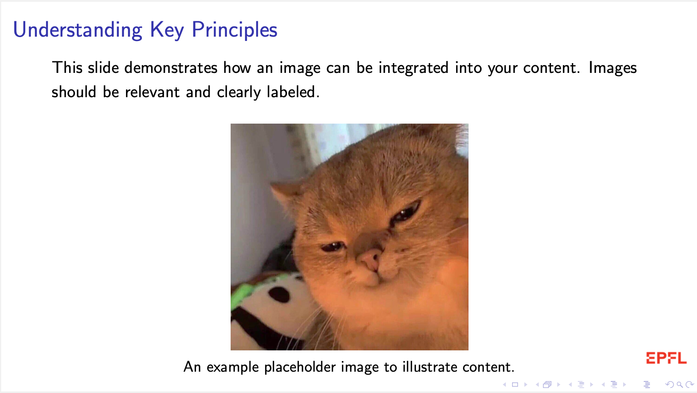

# EPFL Beamer Presentation Template

This repository provides a minimal and clean LaTeX Beamer template designed for EPFL students. It aims to offer a straightforward starting point for your presentations, incorporating the EPFL logo on every slide for official affiliation.

## Example Slides

#### First slide

<center>

</center>

#### Other example slides

<center>

</center>
<center>

</center>

## Features

- **Clean and Minimal Design**: Focuses on content presentation without distracting visual clutter.
- **EPFL Logo Integration**: The EPFL logo is consistently placed in the bottom-right corner of all slides, including the title page.
- **Standard LaTeX Packages**: Includes essential packages for mathematics, graphics, and good document practices.
- **Easy to Customize**: A modular structure with separate files for preamble and math commands.

## Getting Started

1. **Clone the Repository**:

   ```bash
   git clone https://github.com/lucadibello/epfl-beamer-template.git
   cd beamer-template
   ```

This will create a local copy of the repository on your machine. The directory structure will look like this:

```
.
├── main.tex
├── preamble.tex
├── math_commands.tex
└── figures/
    └── epfl.png
```

(The provided `epfl.png` file is not an official version, you might obtain an official version from EPFL's visual identity resources.)

3. **Compile**: You can compile your presentation using the provided `Makefile`.

   ```bash
   make
   ```

   This command will run `pdflatex` twice to ensure that the table of contents and any internal cross-references are correctly generated.

   To remove all generated auxiliary files and the `main.pdf`, run:

   ```bash
   make clean
   ```

## Included Files

- [`main.tex`](main.tex): The main document file where you define your presentation structure, title, author, and include frames.
- [`preamble.tex`](preamble.tex): Contains all LaTeX package inclusions and general Beamer settings for consistent styling.
- [`math_commands.tex`](math_commands.tex): A dedicated file for common mathematical macros and operators.
- `figures/epfl.png`: The placeholder for the EPFL logo used throughout the presentation.
